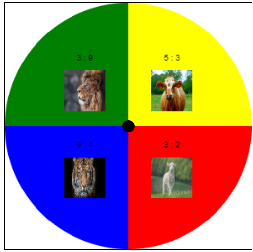

# Простой круг

Данный проект создает круг в центре страницы. 

Круг состоит из 4 секторов разного цвета (сектор содержит картинку животного и два, случайно сгеннрированных при запуске, числа), а также круглой кнопки в центре.

При нажатии на кнопку происходит смена секторов по часовой стрелке.

Состояние круга (количество нажатий и состояние каждого сектора) можно наблюдать в консоле.



## Использование

Для запуска этого проекта необходимо:

1. Склонировать репозиторий на свой компьютер:

   ```bash
   git clone https://github.com/MIX-1/simple_circle.git
   ```

2. Установить nginx и настроить его:

   Чтобы поднять страницу на Nginx с помощью Windows, необходимо выполнить следующие шаги:
   1. Установите Nginx на свой компьютер. Вы можете скачать Nginx для Windows на официальном сайте Nginx.
      https://nginx.org/ru/
   2. После установки откройте командную строку и перейдите в папку, в которую была установлена Nginx.
   3. Затем перейдите в папку "conf", чтобы отредактировать файл конфигурации Nginx. Переместите туда файл nginx.conf из данного проекта
   4. Найдите в этом файле блок "server" и определите путь к корневой директории вашего проекта вместо надписи <i>\*edit your path to index.html\*</i>.
   5. Сохраните изменения в файле "nginx.conf".
   6. Запустите Nginx, введя команду "start nginx" в командной строке.
   7. Откройте браузер и перейдите по адресу http://localhost:80/

Если все настроено правильно, вы должны увидеть страницу с данным проектом в браузере.

Будьте внимательны, при перезапуске проекта, числа сгенерируются заново

## Технологии

Этот проект был создан с использованием следующих технологий:

- HTML: используется для создания структуры веб-страниц.
- CSS: используется для стилизации веб-страниц, использование происходит в index.html
- JavaScript: используется для добавления динамического поведения на страницы.
- GhatGPT: использовался для написания кода {зеркало: https://chatbot.theb.ai/ }

## Автор

Этот проект был создан MIX B в 2023 году.